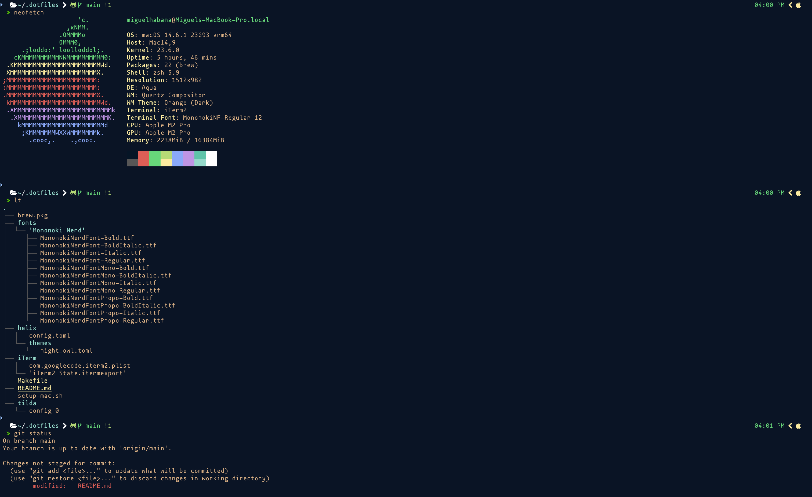

# About

This is my personal dotfiles repository it simplifies setting up my personal workstation with everything I need for my development workflow.



## Features & Tools

- Automatic .envrc loading
- one-line setup and installation

| Tool | Use Case |
|---|---|
| [direnv](https://github.com/direnv/direnv) | environment variable management |
| [btop](https://github.com/aristocratos/btop) | resource monitor with simple GUI |
| [dust](https://github.com/bootandy/dust) | an intuitive disk space utility tool |
| [eza](https://github.com/eza-community/eza) | a prettier `ls` |
| [fd](https://github.com/sharkdp/fd) | user-friendly alternative to `find` |
| [helix](https://github.com/helix-editor/helix) | A Neovim style editor* |
| [asdf](https://github.com/asdf-vm/asdf) | All-in-one version manager |


# Getting Started

## Setup

To setup the configurations and install all the necessary tools and packages, first `cd` into the `.dotfiles` repository and run:

``` bash
sh setup-mac.sh
``` 
